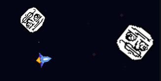

# Asteroids

Asteroids inspired, poorly executed, meme oriented game.



<br/>

<a href=https://poopik.itch.io/asteroids>

</a>


<br/>

## Play
---

You may play the game online in [itch.io](https://poopik.itch.io/asteroids).

To download and play locally (requires python3):

```bash
git clone https://github.com/AdiHarif/Asteroids.git
cd Asteroids
python3 main.py
```

<br/>

## Contribute

---

Feel free to contribute in any of the following:

1. Github Issues - For bug reporting, questions and suggestions.
1. Pull Requests - For contributing code, art and bug fixing.
1. Playing the Game - For fun and feedback.

<br/>

## About us

---

<table>
    <tr>
        <td align="center" valign="top">
            <a href="https://github.com/saarshe">
            
            <br />
            <sub><b>Saar Shechter</b></sub></a>
        </td>
        <td align="center" valign="top">
            <a href="https://github.com/AdiHarif">
            
            <br />
            <sub><b>Adi Harif</b></sub></a>
        </td>
    </tr>
</table>

We started this project back in 2020, during the 3rd year of our undergrad studies. This game was developed as part of a 24 hours long marathon, as a fun, casual and educational project.

Almost three years later, we decided to revive it as a side project. We keep enhance and maintain the game as a hobby on our free time.

